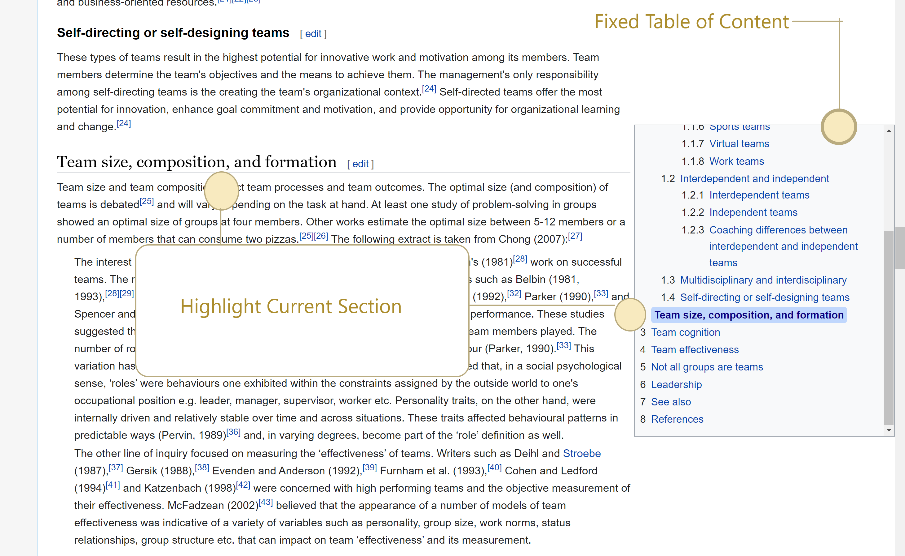
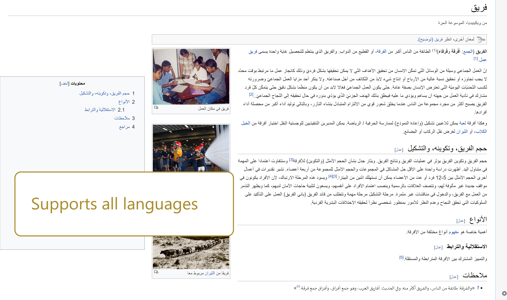
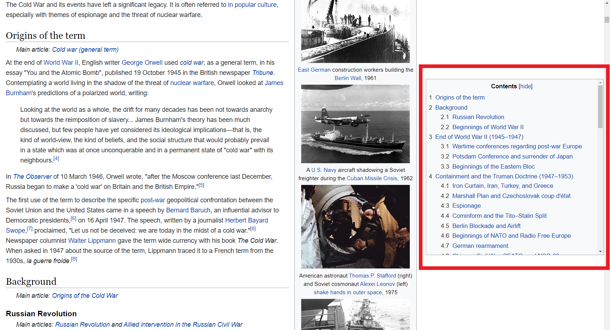
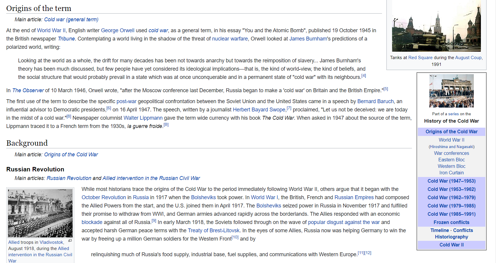

# Better Wiki

Shows table of content at a fixed position for better navigation through wikipedia pages. After **[installing it from chrome extension store](https://chrome.google.com/webstore/detail/better-wiki/bnkpcjahlgjdhiomignedejifpniiijo)** Try it out on any [wiki page](https://en.wikipedia.org/wiki/Cold_War) .

## With Extension

## Without Extension

## Build Commands

### `npm run build`

Build the extension into `dist` folder for **production and development**.

### `npm run build-zip`

Create zip folder of `dist` in `dist-zip` folder.

## Contributing

If you are interested in contributing, please feel free to fork the repository, make changes and send pull request or add issues or new feature requests.